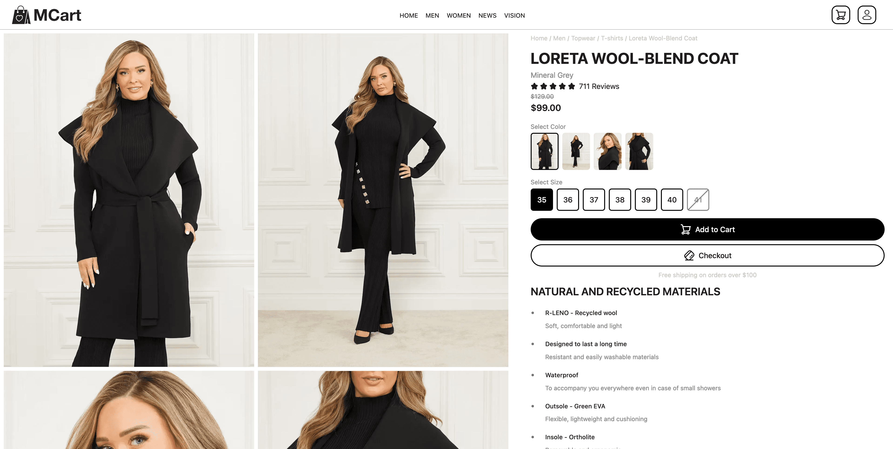
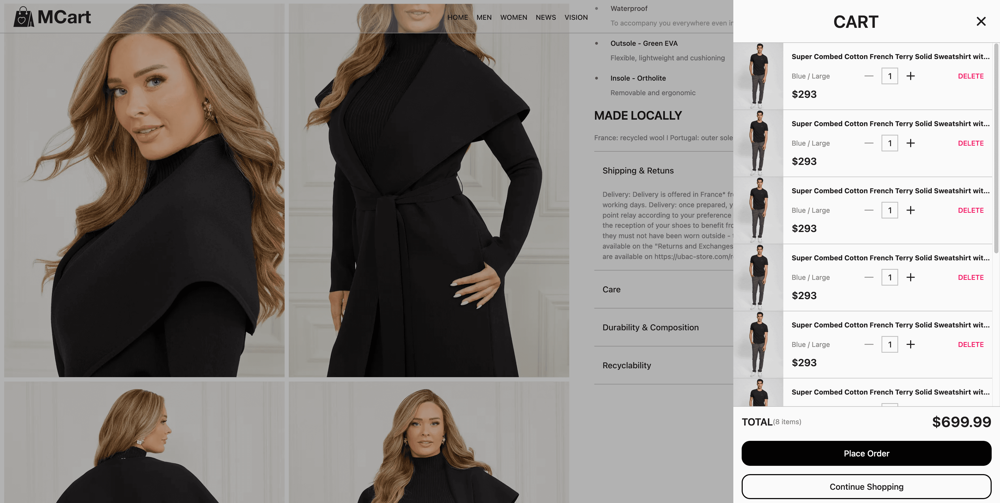

# MCart - A Modern Fullstack E-Commerce Marketplace

Built with **Next.js 15** App Router _frontend_ and **Rust**  **Actix-Web** _backend_


[Demo](https://jamsrworld.com/products/ecommerce-website-in-rust-rust-ecommerce-source-code/dxvhuwl2x0vg3zps0ppdsf34)


---

## Tools & Technologies

- [Next.js](https://nextjs.org)
- [Rust](https://www.rust-lang.org)
- [Actix-Web](https://actix.rs)
- [JamsrUI](https://jamsr-ui.jamsrworld.com)

## Features

### Frontend

- 🚀 Built from Scratch with Next.js 15  
- 🌟 Modern, Clean UI with JamsrUI  
- ⚡  Powered by Turborepo Workspaces  
- 💻 Stunning Landing & Product Pages  
- 🛒 Seamless E-commerce Experience  
- 🔑 Custom Authentication Built with JWT from Scratch  
- ✉️  Beautifully Designed Email Notifications  
- ⌨️  100% TypeScript Codebase  
- 📱 Mobile-First Design  
- 🛠️ Customizable Themes  
- 💾 SEO & Performance Optimized  
- 📊 Vercel Analytics Integration  
- 🔒 Built-in Security  
- 🐳 Dockerfile Included  
- 🔄 Backend-Frontend Type Sync via OpenAPI
- 🎁 …and So Much More!

### Backend

- 🚀 Built in Rust with Actix Web
- ⚡ Rust Workspaces with Cargo
- 🔐 Rate Limiting with Redis
- 🔑 Custom Authentication Built with JWT from Scratch
- ✉️ Beautiful Email Templates with Askama
- 📜 OpenAPI Integration
- 🐳 Dockerfile Included
- ⚙️ Powered by SeaORM
- 🛢️ PostgreSQL Database
- 🔒 Secure & Efficient
- 🎛️ Highly Configurable
- 🎁 ...and More Advanced Features!

---

## Getting started

To get started with this project, run

```shell
  git clone https://github.com/jamsrworld/ecommerce-rust-nextjs-mcart.git
```

### Setup Server

#### Requirements

- [Rust](https://www.rust-lang.org/)
- [PostgreSQL](https://www.postgresql.org/)
- [Redis](https://redis.io/)
- [SeaORM Cli](https://www.sea-ql.org/SeaORM/docs/migration/setting-up-migration/)

Go to `server` folder and:

1. **Copy Environment Variables**  
   Duplicate the `.env.example` file and rename the copy to `.env`.

1. **Fill Out the Variables**  
   Update the `.env` file with the required configuration values.

1. **Run database migrations**  
   Run

   ``` shell
   sea-orm-cli migrate up -d db/migration
   ```

    or

   ```shell
   make run_migration
   ```

1. **You're All Set!**  
  Start the server with

   ``` shell
   cargo run
   ```

     or for live reload

   ```shell
   make dev
   ```

### Setup Client

Go to `client/apps/www` folder and:

1. **Copy Environment Variables**  
   Duplicate the `.env.example` file and rename the copy to `.env`.

1. **Fill Out the Variables**  
   Update the `.env` file with the required configuration values.
1. **Install dependencies**
   Install  `node_modules` with:

   ``` shell
   pnpm install
   ```

1. **You're All Set!**  
  Start terminal at `client/apps/www` and run

   ``` shell
   pnpm dev
   ```

### Image Previews






---

## License

[MIT](https://choosealicense.com/licenses/mit/)

---

This project is built by [Jamsrworld](https://jamsrworld.com/products/ecommerce-website-in-rust-rust-ecommerce-source-code/dxvhuwl2x0vg3zps0ppdsf34).

Need customization or technical support? You can [contact us](https://jamsrworld.com/contact) for assistance.

If you want to support this project you can [buy me a coffee](https://jamsrworld.com/products/ecommerce-website-in-rust-rust-ecommerce-source-code/dxvhuwl2x0vg3zps0ppdsf34).

---
